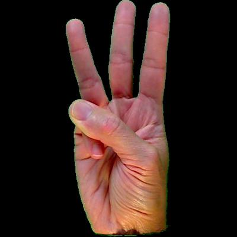

# Dataset description

## 1. Overview 
**Name:** ASL dataset 
**Collector:** Nguyen Quang Minh 
**Source:** [ASL dataset](https://www.kaggle.com/datasets/ayuraj/asl-dataset) 

## 2. Structure 
The dataset is organized into 1 main set.
The set contain 36 subfolder, one for each sign language gesture.

```
asl_dataset
├── 0
├── 1
├── 2
...
├── 8
├── 9
├── a
├── b
...
├── y
└── z
```

**Total samples:** 2,515 images
- **Train:** 2,012 images (80%)
- **Test:** 503 images (20%)

**Image format:** `.jpg` 
**Image size (not resized):** 400x400 pixels 
**Image size (resized):** 64x64 pixels 


## 3. Example Data
### Example Image (W gestrue):


## 4. Prepocessing 
- Resize all images to **64x64** pixels.
- Normalize pixels values to range `[0, 1]` during training 

## 5. Usage
```python
DATASET_PATH = '/media/qminh/New Volume/qm/USTH/COURSES/B3/Project/ASL_Detection/Dataset/nqm_dataset/asl_dataset'

IMAGE_SIZE = 64

X = []
y = []

label_map = {}
label_counter = 0

for folder_name in os.listdir(DATASET_PATH):
  folder_path = os.path.join(DATASET_PATH, folder_name)
  if os.path.isdir(folder_path):
    if folder_name not in label_map:
      label_map[folder_name] = label_counter
      label_counter += 1
    label = label_map[folder_name]

    for img_file in os.listdir(folder_path):
      img_path = os.path.join(folder_path, img_file)
      try:
        img = cv2.imread(img_path)
        img = cv2.resize(img ,(IMAGE_SIZE, IMAGE_SIZE))
        img = img/255.
        X.append(img)
        y.append(label)
      except Exception as e:
        print("Error loading file: ", e)

X = np.array(X)
y = np.array(y)

y = to_categorical(y)

X_train, X_test, y_train, y_test = train_test_split(X, y, test_size=0.2, random_state= 42)
```
